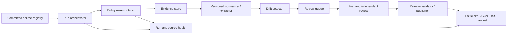

# V1.0 system architecture

## Architectural outcome

Keep the product a small, inspectable batch system: Python CLI, committed registry, SQLite evidence store, and atomically published static artifacts. V1 adds stronger review state, release manifests, source/run health, and recovery—not a web application or account system.

## Quality attributes

| Attribute | V1 target |
|---|---|
| Safety | unreviewed and insufficiently reviewed records are structurally unpublishable |
| Reproducibility | a published observation can be recomputed from retained evidence and versioned normalization |
| Privacy | no consumer identity or behavioral analytics stored |
| Availability | each weekly run attempts ≥99% of attempt-eligible sources; successful retrieval is reported separately and never inferred from attempt; public static feed target 99.9% monthly |
| Recoverability | evidence store RPO ≤24h after a run; RTO ≤4h; restore drill before release |
| Compatibility | schema-major breaking changes only; old fixtures remain readable |
| Maintainability | zero runtime dependencies remains preferred; exceptions require an ADR and security review |

## Component model

### Existing modules and V1 responsibility

| Module | Responsibility | V1 change |
|---|---|---|
| `core/registry.py` | canonical Git-tracked source definitions, gaps, and verification | evidence reference, verification expiry, dated robots/terms/fetch-policy decision, and the shared attempt/publication-eligibility predicate |
| `core/fetch.py` | bounded, honest retrieval | persist redirect chain, status, distinct raw/normalized hashes, truncation/TLS/robots/extraction outcome, and stable error class |
| `core/normalize.py` | text representation | explicit normalizer version and PDF extraction interface |
| `core/store.py` | SQLite operational evidence and decisions | migrations, time-based/pinned retention, dual-review/correction tables, backup metadata |
| `core/detect.py` | compare eligible snapshots | run ID, health linkage, deterministic observation contract, and watcher enforcement of the shared registry eligibility predicate |
| `core/changes.py` | review state machine | independent approval and supersession state |
| `core/publish.py` / `site.py` | consumer artifacts | constrained public observation copy, atomic release, run health, correction chain, signed release manifest, and rejection of unverified/recheck-due/policy-ineligible sources |
| `core/verify.py` | source-verification workflow | qualification note, expiry/recheck queue, evidence reference |
| `cli.py` | operator interface | safe commands for approve, correct, withdraw, doctor, restore-check |

## Data flow and trust boundaries

1. **Registry boundary:** committed maintainer input is untrusted until schema, coverage, verification, and review eligibility checks pass.
2. **Internet boundary:** remote bytes, headers, redirects, filenames, and MIME claims are hostile. Requests are bounded; content is never executed; HTML scripts are discarded from representation but raw bytes remain evidence.
3. **Human decision boundary:** authenticated local operator identity is required for review. Review facts append; later decisions supersede rather than edit.
4. **Publication boundary:** only a validated release view crosses from private evidence storage to public artifacts. Raw pages, operator logs, and internal notes do not publish by default.

## Storage model

The committed Git registry is the sole system of record for source definitions, gaps, source-verification state, verifier/date, the required verification-evidence reference, and the dated robots/terms/fetch-policy decision that determines eligibility. SQLite is the system of record for operational runs, attempts, snapshots, observations, reviews, corrections, and publication receipts; each run stores the exact registry revision, exact eligible numerator/denominator lists, and a non-authoritative source-identity copy for provenance. A SQLite cache may accelerate registry queries but cannot change eligibility and must be recreated from the committed registry. One shared predicate is called by both watcher and publisher; it fails closed for unverified, expired/recheck-due, policy-ineligible, rejected, withdrawn, or gap sources. Original bytes are stored as bounded blobs for current scale; move to content-addressed object storage only when the measured database size or backup window requires it. Public output is immutable-by-release and promoted atomically from a temporary directory.

Core entities:

- `registry_revision`, `run_source`, `run`, `fetch_attempt`, `snapshot`;
- `observation`, `review_decision`, `publication`, `publication_item`;
- `correction`, `source_health`, `release_manifest`, `migration`.

Each table has stable IDs, UTC timestamps, actor where applicable, and append-only history for decisions. Foreign keys are enabled. A migration checksum is recorded before startup.

## Interfaces

### Operator CLI

Commands remain the privileged write surface: registry validation, source verification, watch, evidence diff, first review, independent approval, correction/withdrawal, publication, health diagnosis, backup, and restore verification. Destructive actions require explicit IDs and a typed reason; no bulk “approve all” exists.

### Public read contract

- `changes.json` and `changes-us-<jurisdiction>.json` — schema-major `2`; the major-1 schema
  remains published as the pre-independent-review/correction compatibility contract;
- `feed.xml` and per-jurisdiction RSS;
- `sources.json` — sources, gaps, verification and health;
- `status.json` — last attempted/successful run, completeness, stale threshold;
- `release.json` — artifact hashes, schema versions, generated time, release ID, signing algorithm/key ID, and detached-signature reference.

The public verifier ships with a pinned trust manifest that maps key IDs to release-signing purpose and validity interval. The key runbook covers offline key custody, two-person activation, rotation overlap, verifier updates, revocation, compromise notification, and verification behavior when revocation freshness cannot be established.

Use ETag/Last-Modified on the host when available. V1 does not expose a mutable HTTP API or webhook service.

## Reliability design

- One run lock prevents overlapping writers; stale locks require an explicit recovery command.
- Every fetch is idempotent by `(run_id, source_id)` and every observation by source transition.
- Retry only bounded transient network errors, with jitter and host pacing; do not retry policy blocks.
- A source failure cannot abort unrelated sources; a database or release-validation failure aborts publication.
- Publication builds to a new directory, validates every byte, then atomically swaps the release pointer.
- Backup occurs after a successful run and before pruning; restore is tested into a clean path. Time-based pruning must never delete evidence pinned by a publication, correction, incident, or hold. The current five-snapshot pruning implementation is a known V1 blocker and is replaced before production evidence begins.

## Deployment topology

V1 runs on one named, patched persistent host with an encrypted persistent volume for SQLite/evidence, a least-privilege scheduler identity, an off-host encrypted backup destination, and a separate static-artifact host. Reviewed commits promote through staging to production; database migrations and signing happen only on the persistent runner, and the static host receives validated immutable release directories. Host build, storage path, scheduler, DNS/TLS ownership, backup credentials, promotion command, rollback pointer, and disaster-recovery owner are recorded in the deployment runbook and release receipt. The existing ephemeral scheduled workflow remains a diagnostic, not the production store.

## Scale model

V1 assumes 200 active sources, weekly cadence, ≤10 MiB bounded response, and fewer than 100 observations/month. SQLite and a single worker are ample. Host pacing, not compute, is the constraint. Revisit architecture at 2,000 sources, daily cadence, >50 GiB evidence, or concurrent reviewer writes.

## Rejected alternatives

- **Always-on SaaS/API:** adds identity, auth, attack surface, and operating burden without improving weekly public-feed value.
- **LLM extraction/classification:** creates opaque legal-significance claims and unreproducible evidence.
- **Browser automation by default:** increases evasion, instability, and terms risk; unsupported sources remain explicit gaps.
- **Mutable current-state rows only:** destroys the correction and audit history the product’s trust depends on.
- **Blockchain/notarization:** content hashes plus signed release manifests and retained bytes provide the needed verification without a public permanent ledger.
